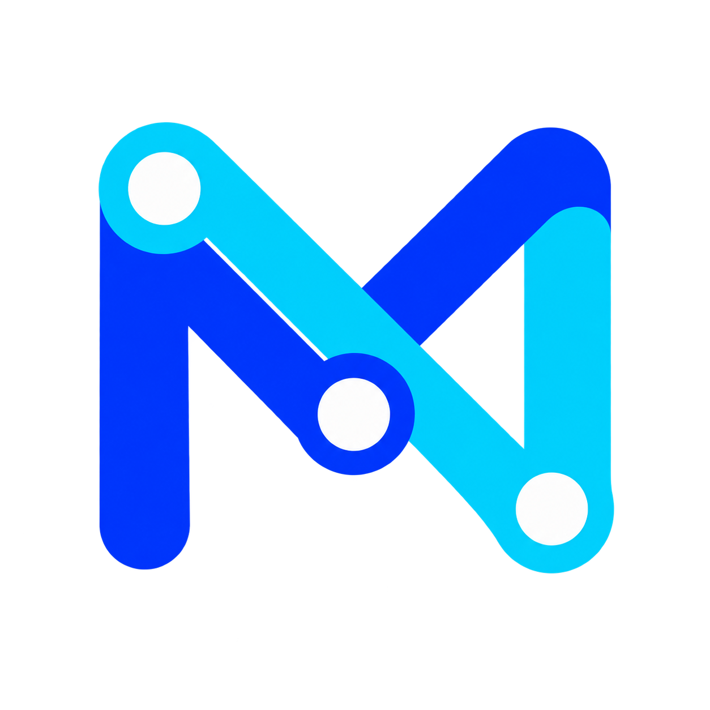

<p align="center">
  
</p>

# MyAPI

モデルサービス、アプリのアクセス、権限、使用量を一元管理するセルフホスト型 AI API ゲートウェイ。

[English](README.md) · [简体中文](README.zh_CN.md) · [繁體中文](README.zh_TW.md) · [Français](README.fr.md) · [日本語](README.ja.md)

MyAPI はモデルサービス接続、アプリ用 API キー、権限、使用量を一つの管理画面にまとめます。個人利用を優先し、少人数への管理された共有にも対応します。新規インストールでは商用モジュールが無効で、内部ウォレットへのチャージは不要です。ユーザー管理、権限、キーの制限と使用量記録は引き続き有効です。

## 技術スタック


- **バックエンド：** Go（`go.mod` は 1.25.1）、HTTP ルーティングに Gin、データアクセスに GORM
- **管理画面：** React 19、TypeScript、Rsbuild、Tailwind CSS 4、Base UI。Bun でフロントエンド依存関係とスクリプトを管理
- **ストレージ：** 既定は SQLite、または MySQL/PostgreSQL。共有キャッシュとレート制限向け Redis は任意
- **配置：** Docker イメージと Docker Compose。イメージ導入にはローカルの Go/フロントエンドビルド環境は不要

### リクエストの流れ

```text
アプリ + API キー → MyAPI の認証・権限チェック
                 → モデル・チャネル選択 → モデルサービス
                 ← 応答 / ストリーム    ←
                   使用量・エラー記録
```

管理画面でチャネル、モデル、ユーザー、キーを設定します。Go サービスは権限を確認し、利用可能なチャネルを選んでモデルサービスを呼び出し、取得できる使用量の根拠を記録します。サービスの認証情報はサーバーに保持し、プロトコルと予算には以下の制約が適用されます。

バージョンはリポジトリの宣言に基づき、将来の全バージョンの互換性は保証しません。[サーバー依存関係](go.mod)、[画面の依存関係](web/package.json)、[コンテナビルド](Dockerfile)を参照してください。

## 機能と制約

- OpenAI 互換 API、Responses、Claude Messages、Gemini、Codex などの既存アダプターでチャネルと公開モデルを設定できます。実際の機能はアダプターとモデルサービスアカウントに依存します。
- アプリやユーザーごとにアプリ用キーを発行し、モデル、アクセスプロファイル、適用可能な使用量制限を設定できます。モデルサービス認証情報はサーバーに保持します。
- リクエスト、エラー、使用量、対応プロバイダーのクォータ観測を確認できます。欠測、失敗、期間のリセットをゼロ消費と区別します。
- モデル、エンドポイント、ストリーミングを指定してテストし、適用可能な場合は直近の成功設定を再利用できます。
- SQLite、MySQL、PostgreSQL から一つを選択できます。画面は英語、簡体字・繁体字中国語、フランス語、日本語、ロシア語、ベトナム語に対応します。

厳密な Token/USD 予算は、資格を満たす公式ネイティブ Responses のテキスト専用経路に限られます。USD には適用可能な固定価格と対応サービス階層も必要です。別名、変換、ツール、マルチモーダルは自動的に対象になりません。Codex の割合はアカウント/期間の残量に対する安全しきい値であり、共有サブスクリプションのキー別消費台帳ではありません。API 換算コストは参考値で、実際の請求額ではありません。不明・推定の使用量も実測ゼロではありません。

## バージョン

2026-10-04 時点：

- **公開済みプレリリース：`v0.2.0-beta.3`**。Linux amd64/arm64 用 Full と従来 LAN イメージ。[公開記録](docs/RELEASE_BETA_3.md)にソース、digest、署名、検証範囲を記載しています。
- **beta.4：検証済み開発ソース、未公開**。限定されたモデル検出、明示的マッピング、ルーティングプレビュー、送信、ログの機能で、beta.3 イメージには含まれません。
- **beta.5：ローカル開発候補のみ**。アカウント選択、一時クールダウン、上限付きフェイルオーバー、試行説明は未公開です。この候補自体のリモート三種類の DB と Chromium 検証は未完了です。

プレリリースは本番運用の保証ではありません。実アカウント OAuth、クォータのリセット/429、請求照合、対象サーバーの HTTPS 検証は限定的または未実施です。コンテナの正常性だけでは実際のモデルサービスを検証できません。開発ソースを取得しても既定イメージは beta.3 のままです。統一 Lite/Desktop インストーラー・更新機能は未提供で、デスクトップ成果物のビルド成功も実機検証を意味しません。

## 公開版のインストール

推奨経路は **Linux Full、固定 Docker イメージ、SQLite、HTTPS リバースプロキシ背後のループバック待受**です。

Linux amd64/arm64、Git、Bash、稼働する Docker、`up --wait --wait-timeout` 対応の Compose v2 が必要です。リポジトリ読取権限、GitHub/GHCR への接続、永続ストレージ、自分で管理する HTTPS Origin も用意してください。プロキシ転送先は `http://127.0.0.1:3000` です。下記の秘密値生成には OpenSSL を使います。この経路では Go、Bun、Node.js、Redis、別 DB サーバーは不要です。既定の 2 CPU / 2 GiB はコンテナの上限で、測定済み最低ハードウェア要件ではありません。

### 1. 配置ファイルを取得

新しいディレクトリへの新規インストール専用です。既存 `.env` を上書きしないでください。

```bash
git clone --branch v0.2.0-beta.3 --single-branch https://github.com/ForceMind/MyAPI.git my-api
cd my-api
umask 077
cp deploy/.env.example deploy/.env
chmod 600 deploy/.env
```

### 2. 設定

`deploy/.env` を編集します。例の Origin は、自分の正確な HTTPS Origin に置き換え、API パスは含めません。`example.com` の仮ドメインはインストーラーで拒否されます。

```dotenv
MYAPI_IMAGE=ghcr.io/forcemind/myapi:v0.2.0-beta.3
MYAPI_BUILD_LOCAL=false
MYAPI_EDITION=full
MYAPI_BIND_ADDRESS=127.0.0.1
MYAPI_ALLOW_LAN=false
MYAPI_SESSION_COOKIE_SECURE=true
MYAPI_PUBLIC_URL=https://api.example.com
FULL_CONTENT_LOG_ENABLED=false
```

新規インスタンス用の `SESSION_SECRET` を生成し、非公開のエディターで結果を設定してください。48 文字以上が必要です。

```bash
openssl rand -hex 32
```

複数アカウントのクォータ観測には独立した秘密値も生成し、`CHANNEL_QUOTA_IDENTITY_KEYS` を `active:v1:` とその結果の連結にします。

```bash
openssl rand -base64 32 | tr '+/' '-_' | tr -d '=\n'
```

空のキーリングでは、ID に依存する観測が無効になります。同じ DB の各インスタンスで完全なキーリングを共有し、DB と一緒に安全にバックアップしてください。アップグレード時は既存の秘密値を再生成せず、Git や問い合わせにも貼り付けません。`.env` は文字どおりの `KEY=VALUE` で、シェル展開を実行しません。既定の保存先は `deploy/data/` と `deploy/logs/`、コンテナ内では `/data` と `/app/logs` です。

### 3. 起動

```bash
bash deploy/install.sh
```

設定の検証、イメージ取得、起動、最大 120 秒の正常性待機を行います。Docker の導入、証明書取得、プロキシ・ファイアウォール設定は行いません。設定した HTTPS URL を開き、初期化と管理者作成を完了し、ログインとシステム情報の version/revision を確認してください。Full は Secure Cookie を使うため、HTTP localhost は推奨ログイン先ではありません。

ローカル/私設 LAN で使う場合は[従来 LAN ガイド](docs/LAN_LITE.md)と `ghcr.io/forcemind/myapi-lan:v0.2.0-beta.3` を使用します。LAN 共有は明示的に有効化してください。

## 最初の呼び出し

1. Channels (`/channels`) で正しいプロバイダー、URL、認可済み認証情報を設定します。コンテナの Codex は既存の Web ログイン経路を使い、ホストのログインファイルは読めません。
2. 対応する場合はモデル一覧を取得し、それ以外は正確な ID を入力します。有効モデル、グループ/アクセスプロファイル、マッピングを確認してください。検出だけでは権限や動作は保証されず、拡張 beta.4 機能には開発ソースが必要です。
3. モデル、対応エンドポイント、ストリーミングを明示し、小さなテストを実行します。モデルサービスへの接続でクォータ消費や料金が発生し得るため、非機密入力を使います。
4. アプリ専用の最小権限のアプリ用キーを作成します。モデルサービスキーや管理者ログイントークンを共有しないでください。
5. OpenAI 互換クライアントでは HTTPS Origin に `/v1` を付け、アプリ用キーと有効な公開モデル名を指定します。他のプロトコルは対応文書のエンドポイントを使い、まず短いリクエストを送ります。
6. Usage Logs (`/usage-logs/common`) で状態、モデル、使用量の根拠、適用コストを確認します。ルーティング証拠を持つ開発版では管理者が送信先も確認できますが、プレビューは次のランダム選択や特定キーの利用許可を保証しません。

失敗時はエンドポイント、モデル、認証情報、権限、モデルサービスクォータを確認してから再試行を検討してください。根拠がない不明結果は要確認のまま保持します。

## 保守と復元

[配置テンプレート](deploy/.env.example)と[実行時変数](.env.example)は別レイヤーです。`.env` に追加した任意の変数は自動転送されないため、外部 DB/Redis は [Compose](deploy/docker-compose.yml) を確認してください。SQLite が既定で、MySQL ≥ 5.7.8、PostgreSQL ≥ 9.6 は互換基準です。適切に保守されたバージョンを選び、移行を検証してください。Redis は任意ですが、複数ノードのセッション/レート制限には別途設定が必要です。

ソース CLI は Node.js ≥ 20 が必要です。このガイドでは取得したリポジトリの CLI を使い、NPM からのパッケージインストールには依存しません。

```bash
node cli/myapi.mjs help
node cli/myapi.mjs doctor --project-dir .
node cli/myapi.mjs status --project-dir .
node cli/myapi.mjs logs --project-dir .
```

`doctor` は実際のモデルサービスの検証ではなく、ログは機密情報を含む可能性があります。`install`、`switch`、`rollback` は未実装のコマンドです。

更新前に version/digest、revision、パス、設定を記録し、一貫した DB バックアップ（必要な SQLite WAL を含む）、秘密値、完全なキーリング、必要なログを保存します。隔離コピーで復元を確認してから、公開済み対象バージョンを試してください。旧インスタンスを beta.3 に更新する場合の読取専用事前確認例：

```bash
node cli/myapi.mjs upgrade --project-dir ./upgrade-copy --version v0.2.0-beta.3 --dry-run --json
```

実操作は[更新・復元ガイド](docs/UPGRADE_REHEARSAL.md)に従います。CLI の `.env` バックアップは DB バックアップではありません。対象起動を試みた後は DB が移行済みの可能性があるため、旧イメージを自動再起動しません。互換性のない旧バイナリーを起動する前に、検証済み更新前 DB を復元してください。ボリュームや未解決記録の削除で復旧しようとせず、`latest` や計画段階のバージョンも使わないでください。

## セキュリティと文書

ループバック待受を保ち、共有前に HTTPS、信頼するプロキシ、登録、役割、キー権限を確認します。認可されたアカウント/API のみ使い、モデルサービス規約と適用法に従ってください。公開サービスでは別の適法性確認が必要な場合があります。配置テンプレートは全文ログが既定で有効ですが、上記例では無効化しています。有効にする前に権限、保存期間、バックアップを確認してください。マスキングだけでは入力/出力の個人・機密情報をすべて除去できません。クォータ観測はバックグラウンドでモデルサービスに接続する場合があります。秘密値、OAuth ファイル、DB、私有ログを Git や不具合報告に含めないでください。

- [公開と検証記録](docs/RELEASE_BETA_3.md) · [配置](DEPLOYMENT_CUSTOM.md) · [LAN](docs/LAN_LITE.md)
- [復元](docs/UPGRADE_REHEARSAL.md) · [インストール検証](docs/R1_INSTALLATION_CHECK.md)
- [Relay API](docs/openapi/relay.json) · [管理 API](docs/openapi/api.json)
- [クォータ分析](docs/QUOTA_ANALYTICS.md) · [Claude 組織使用量](docs/CLAUDE_USAGE_REPORT.md)
- [認証](docs/authentication.md) · [全文ログ](docs/FULL_CONTENT_LOGGING_CUSTOM.md)
- [不具合報告](https://github.com/ForceMind/MyAPI/issues)：version/revision、配置方式、機密情報を除いた再現手順を添付

開発者向け：[開発計画と実装記録](docs/MYAPI_MASTER_PLAN.md)。詳細文書の一部は中国語です。

## ライセンスと法的通知

[GNU AGPLv3](LICENSE) に従います。[NOTICE](NOTICE) に第 7 条の追加条件と必須の法的・UI 帰属表示、[第三者ライセンス](THIRD-PARTY-LICENSES.md)に依存関係の通知を記載しています。配布または変更版のネットワーク提供では、適用通知の保持、変更の明示、対応ソースの提供義務を遵守してください。デスクトップ配布では該当する Electron/Chromium 通知も保持します。利用・再配布前に全文を確認してください。
